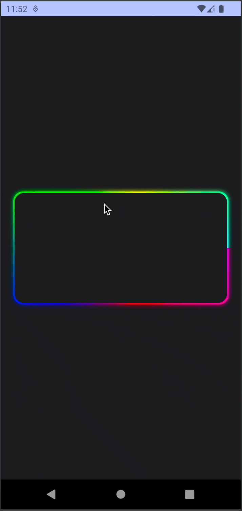

# Compose3DCard

A customisable card component that displays an emulated 3-D effect when touched and dragged. Inspired by [this](https://twitter.com/k_sokolovskyi/status/1559956912900395009) tweet, I tried to replicate the same thing in Jetpack Compose as well.
## Demo

